

  

<h1 align="center">Laboratorio 1 - Grupo 6</h1>

  <b>MCIB-B</b> 
  Trabajo grupal enfocado en el desarrollo, contenerización y despliegue de un API funcional.

<h2>Integrantes</h2>

<ul>
  <li>AMAGUA OSCAR</li>
  <li>OJEDA ALAN</li>
  <li>SUNTAXI DIEGO</li>
</ul>

<h2>Introducción</h2>

El presente proyecto tiene como objetivo el diseño, construcción, contenerización y despliegue de una API funcional orientada al análisis de seguridad de archivos. La solución desarrollada permite autenticar usuarios mediante tokens JWT, procesar solicitudes a través de endpoints REST (GET y POST), y consumir servicios externos, específicamente la API de VirusTotal, con el fin de obtener información sobre posibles amenazas asociadas a un hash de archivo.

La API actúa como un intermediario inteligente que no solo consulta información externa, sino que también aplica lógica propia para interpretar los resultados, generando un veredicto simplificado y un indicador de riesgo. De esta manera, se simula el funcionamiento de sistemas utilizados en entornos reales de ciberseguridad, como centros de operaciones de seguridad (SOC), donde es necesario analizar rápidamente archivos sospechosos y tomar decisiones informadas.

Adicionalmente, el proyecto incorpora buenas prácticas de desarrollo de software, incluyendo el uso de control de versiones con GitHub para la gestión colaborativa del código, la contenerización mediante Docker para asegurar la portabilidad y consistencia del entorno de ejecución, la validación de endpoints utilizando herramientas como curl, y el despliegue en la nube a través de servicios como Google Cloud, garantizando así la disponibilidad y accesibilidad del servicio.

En conjunto, esta solución no solo cumple con los requerimientos técnicos planteados, sino que también representa una aproximación práctica al desarrollo de APIs modernas, seguras y escalables, integrando múltiples tecnologías y servicios en un flujo de trabajo completo desde el desarrollo hasta el despliegue en producción.

<h2>Objetivo</h2>

  Diseñar, construir, contenerizar y desplegar un API funcional, aplicando buenas prácticas de desarrollo, versionamiento, pruebas y despliegue en la nube.

<h2>Parte 1 – Construcción del API</h2>

<h3>Repositorio del proyecto</h3>
<ul>
  <li>Código fuente del API</li>
  <li>README documentado</li>
  <li>Dockerfile funcional</li>
  <li>requirements.txt</li>
</ul>

<h3>API funcional</h3>
<ul>
  <li>Flask</li>
  <li>FastAPI</li>
  <li>Otro framework Python aprobado</li>
</ul>

<h3>Funcionalidades mínimas</h3>
<ul>
  <li>Endpoint <b>GET</b></li>
  <li>Endpoint <b>POST</b></li>
  <li>Validación básica de datos</li>
  <li>Respuestas en formato JSON</li>
</ul>

<h3>Creatividad</h3>
<ul>
  <li>Integración con APIs externas</li>
  <li>Sistema de scoring</li>
  <li>Procesamiento de datos</li>
  <li>Logs estructurados</li>
  <li>Autenticación básica</li>
</ul>

<h3>Evidencia</h3>
<h5>Codigo API</h5>

  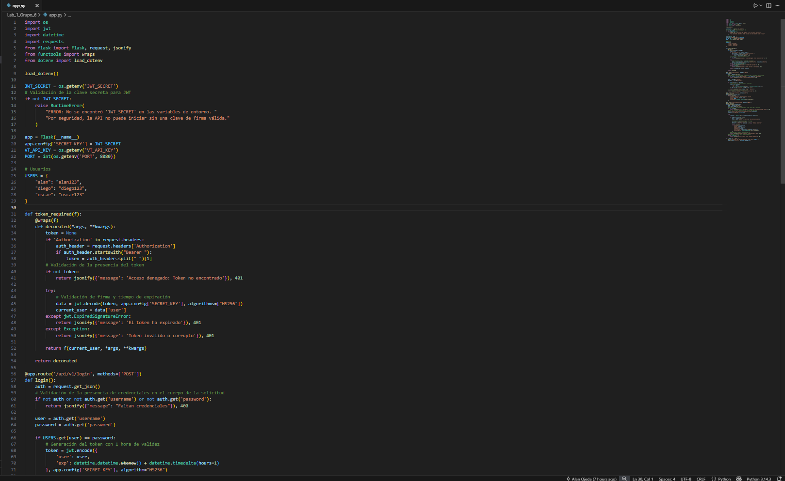
  

<h5>Estructura del codigo de la API</h5>

  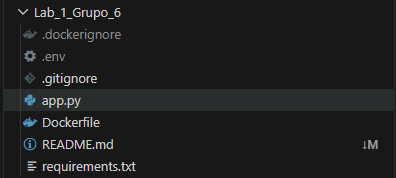

<h5>Codigo Requirements</h5>

  

<h5>Codigo Dockerfile</h5>

  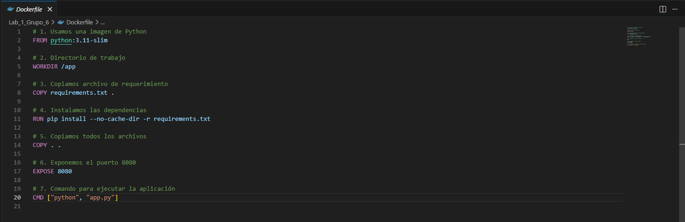

<h5>Codigo de gitignore</h5>

  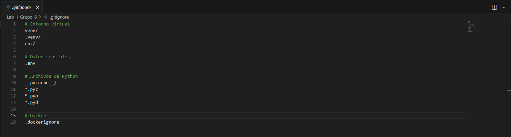

<h5>Codigo de dockerignore</h5>

  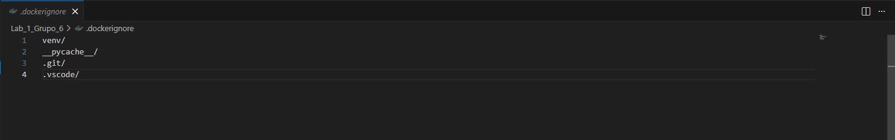

<h5>Codigo de Env</h5>

  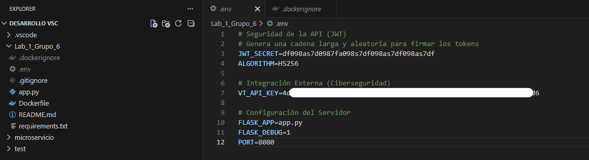

<h3>Comentario</h3>

  En esta fase se desarrolló la estructura base del API, implementando endpoints GET y POST con validaciones básicas. 
  Se utilizó FastAPI por su facilidad de uso y documentación automática.

<h2>Parte 2 – Uso de Branches</h2>

  Se desarrollaron funcionalidades en ramas independientes y luego se integraron a la rama principal <code>main</code>.

<ul>
  <li><code>feature/geolocalizacion</code></li>
  <li><code>feature/scoring</code></li>
  <li><code>feature/auth</code></li>
</ul>

<h3>Evidencia</h3>
<h5>Historial de cambios en ramificaciones</h5>

  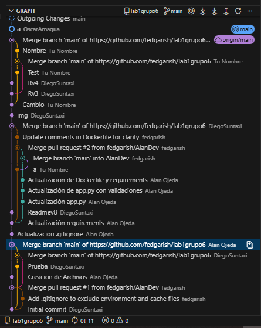

<h5>Estructura de ramificaciones de git</h5>

  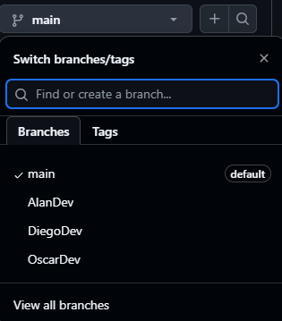

<h3>Comentario</h3>

  El uso de branches permitió trabajar de manera organizada y evitar conflictos en el código principal, facilitando la integración continua.

<h2>Parte 3 – Contenerización</h2>

<ul>
  <li>Dockerfile funcional</li>
  <li>Imagen construida sin errores</li>
  <li>Contenedor ejecutando correctamente</li>
</ul>

<h3>Evidencia</h3>
<h5>Creación del docker</h5>

  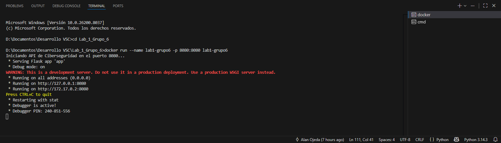

<h5>Estructura del docker</h5>

  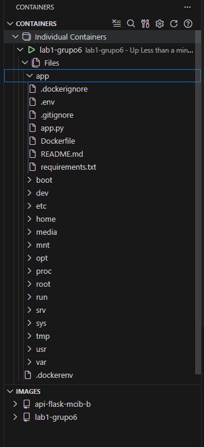

<h5>Prueba de creacion del docker sin error</h5>

  

<h3>Comentario</h3>

  Se logró contenerizar el API correctamente, permitiendo su ejecución en cualquier entorno sin dependencias externas.

<h2>Parte 4 – Pruebas con curl</h2>

<ul>
  <li>GET funcionando</li>
  <li>POST funcionando</li>
  <li>Manejo de errores</li>
</ul>

<h3>Evidencia</h3>
<h5>Prueba de funcionalidad endpoints GET y POST con Curl</h5>

  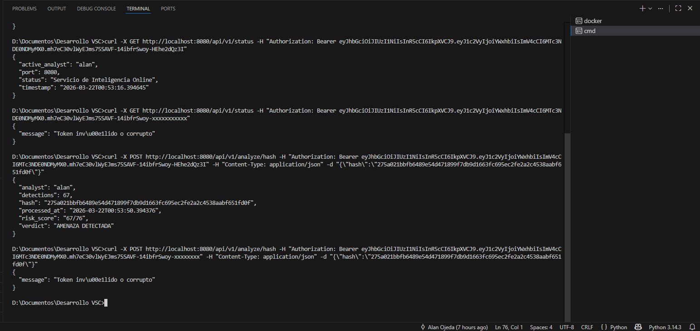

<h5>Prueba de funcionalidad validación errores con Curl</h5>

  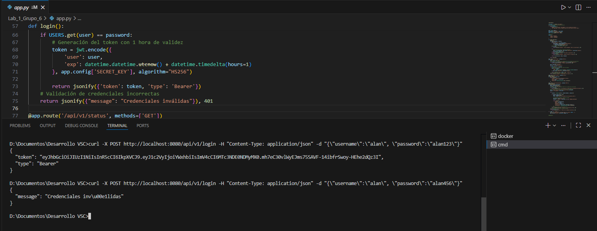

<h3>Comentario</h3>

  Las pruebas con curl permitieron validar el correcto funcionamiento de los endpoints y el manejo adecuado de errores.

<h2>Parte 5 – Despliegue en Cloud</h2>

<ul>
  <li>Cloud Run</li>
  <li>Compute Engine</li>
  <li>Otro servicio cloud</li>
</ul>

<h3>Evidencia</h3>
<h5>Proceso de despliegue en Google Cloud</h5>

  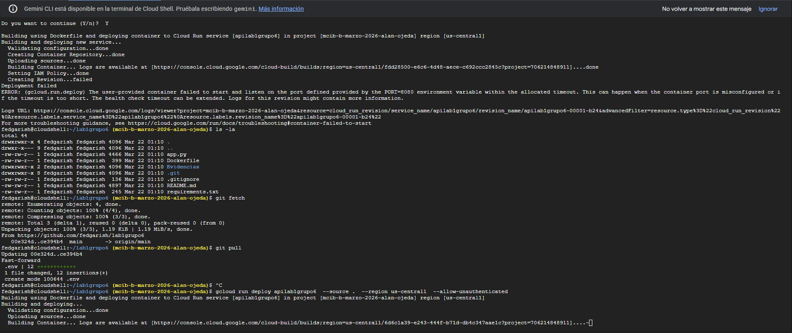
  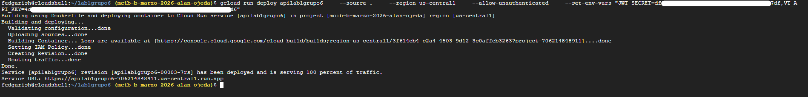

<h5>Verificación de funcionalidad de endpoints</h5>

  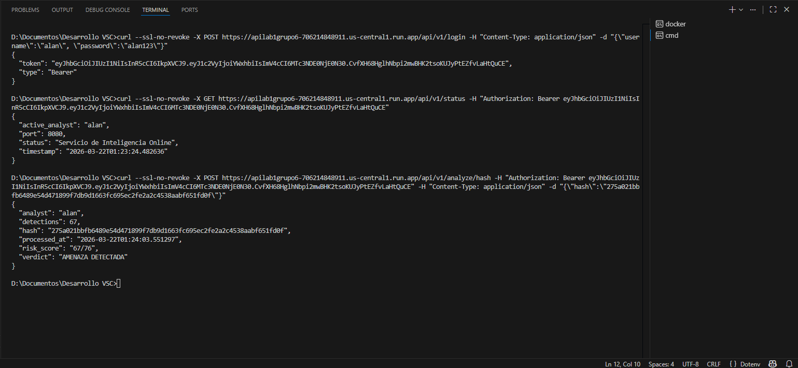

<h5>Verificación de metricas generadas de la API</h5>

  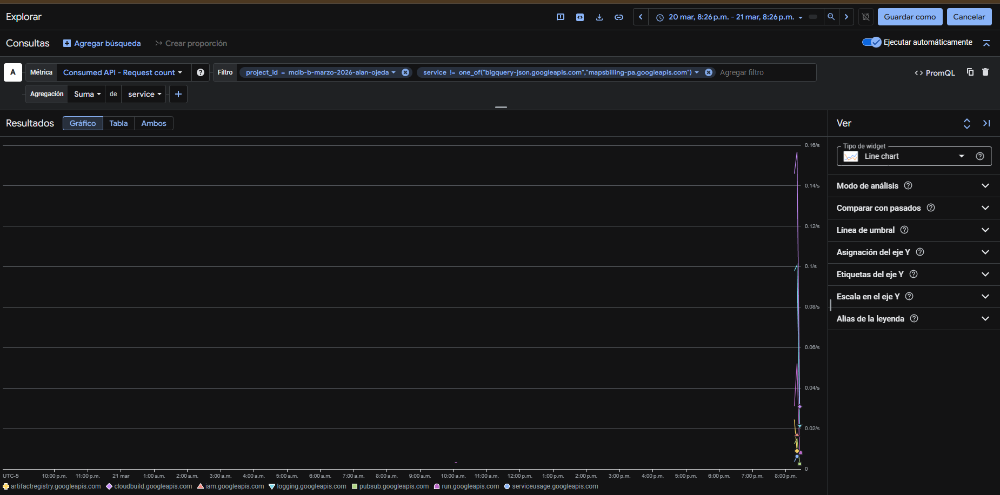

<h5>Eliminación del despliegue</h5>

  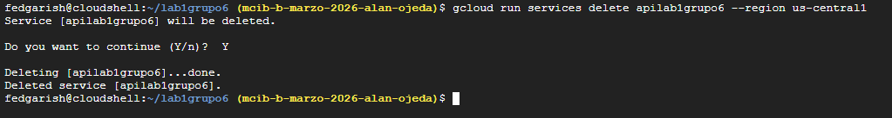

<h3>Comentario</h3>

  El despliegue en la nube permitió acceder al API de forma remota, garantizando disponibilidad y escalabilidad.

<h2>Conclusiones</h2>
<ul>
  <li>La correcta configuración de las variables globales de Git es fundamental para identificar adecuadamente los commits y mantener un historial limpio en trabajos colaborativos.</li>
  <li>El flujo adecuado de trabajo siempre debe iniciar con un git pull, seguido del desarrollo, commit y finalmente un git push, evitando conflictos y pérdidas de información.
El uso de ramas permite trabajar de forma ordenada sin afectar la rama principal, facilitando la revisión y la integración de cambios mediante Pull Requests.</li>
  <li>La integración de variables sensibles mediante .env dentro del flujo de Docker proporcionó un nivel adicional de organización y seguridad. Esto evitó exponer claves privadas o configuraciones críticas en el repositorio, manteniendo buenas prácticas en la gestión de credenciales y configuraciones.</li>
  <li>El uso de Docker permitió estandarizar completamente el entorno de ejecución, garantizando que la API se comporte de la misma manera en cualquier máquina. Esto eliminó problemas recurrentes asociados a diferencias en versiones de Python, dependencias o configuraciones locales entre los integrantes del equipo.</li>
  <li>La integración del archivo .env dentro del flujo de Docker reforzó la seguridad al evitar exponer claves sensibles, además de simplificar la configuración del entorno.</li>
  <li>El archivo .env no funcionó correctamente en GCloud porque incluía variables que la plataforma tiene reservadas, como PORT. Como medida de seguridad, GCloud activa un bloqueo por timeout cuando una aplicación no arranca de manera adecuada, lo que impidió que la API se desplegara correctamente. Para solucionar esto, fue necesario eliminar esas variables del entorno y configurar únicamente los secretos válidos, permitiendo que Cloud Run arrancara la API correctamente y sin bloquearla.</li>
</ul>

